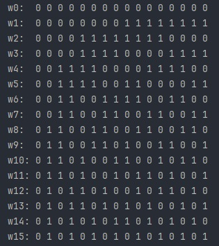

# [Walsh Functions](https://en.wikipedia.org/wiki/Walsh_function)
Walsh complete orthogonal set of functions based on  Rademacher functions. \
The source of materials are [here](https://rusneb.ru/catalog/000199_000009_006676890/) \

Normalized walsh functions set \

